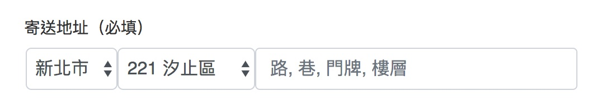
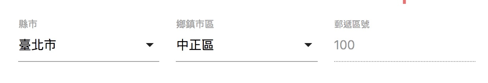

# erTWZipcode.js

HTML 表單用簡易版台灣縣市地區與郵遞區號選擇器。

- no jquery needed.
- ie friendly.
- 地區欄位支援合併郵遞區號顯示。
- 只提供給表單元件 `<select>` 與 `<input>` 使用。
- 因為是單純表單元件，表單相關的輸出不做處理。

#### updated at 0717,2019

- 新增郵遞區號爬蟲器(use python with jupyter notebook)
- 將郵遞區號資料分離到 er.twzipcode.data.js 內
- 新增 .html 範例檔

#### 欄位說明
```jsvascript
erTWZipcode(
    countySelector: '縣市用 css selector, 預設 select[name="county"]',
    districtSelector : '地區用 css selector, 預設 select[name="district"]',
    zipcodeSelector : '郵遞區號的 css selector, 預設 input[name="zipcode"]',
    defaultCountyText : '縣市select的初始文字',
    defaultDistrictText : '地區select的初始文字'
);
```
#### 地區select 支援合併郵遞區號顯示
```
<select name="district" zipcode-align="left or right" required=""></select>
```

## 如何使用？

### Bootstrap 4


不顯示郵遞區號 input text

```html
<body>
<!-- -省略 -->
<div class="form-group">
    <label class="col-form-label" for="twzipcode">寄送地址（必填）</label>
    <div class="row pl-3 pr-3" id="twzipcode">
      <select class="col-md-2 form-control" name="county" aria-describedby="form-county" required=""></select>
      <select class="col-md-3 form-control" name="district" aria-describedby="form-district" zipcode-align="left" required=""></select>
      <input class="col-md-7 form-control" id="address" type="text" name="address" aria-describedby="form-address-input" required="" placeholder="路, 巷, 門牌, 樓層">
      <input class="d-none" name="zipcode">
    </div>
</div>
<!-- -省略 -->
<script src="/js/er.twzipcode.data.js"></script>
<script src="/js/er.twzipcode.min.js"></script>
<script>
    erTWZipcode();
</script>
</body>
```

### Materialize CSS



```html
<form class="form" id="myForm" action="">
  <div class="row">
    <div class="input-field col s4">
      <select name="county"></select>
      <label>縣市</label>
    </div>
    <div class="input-field col s4">
      <select name="district"></select>
      <label>鄉鎮市區</label>
    </div>
    <div class="input-field col s4">
      <input class="validate" id="zipcode" name="zipcode" disabled type="text" value=" ">
      <label for="zipcode">郵遞區號</label>
    </div>
  </div>
</form>

<!-- -省略 -->

<script>
  erTWZipcode({
    defaultCountyText: "請選擇",
    defaultDistrictText: "請選擇"
  });
  var distEl = document.querySelector('#myForm select[name=district]');
  document.querySelector('#myForm select[name=county]')
    .addEventListener("change", function(evt){
      //refresh district element
      M.FormSelect.init(distEl);
    });
  //first time init all select elements in #myForm
  M.FormSelect.init(document.querySelectorAll('#myForm select'));
</script>
```

### 多組地址選擇設定
只需要分別設定該組的 `css selector` 即可多組分開控制。
```
//#form1
erTWZipcode(
    countySelector: '#form1 select[name="county"]',
    districtSelector : '#form1 select[name="district"]',
    zipcodeSelector : '#form1 input[name="zipcode"]',
);

//#form2
erTWZipcode(
    countySelector: '#form2 select[name="county"]',
    districtSelector : '#form2 select[name="district"]',
    zipcodeSelector : '#form2 input[name="zipcode"]',
);

```

## LICENSE
MIT

